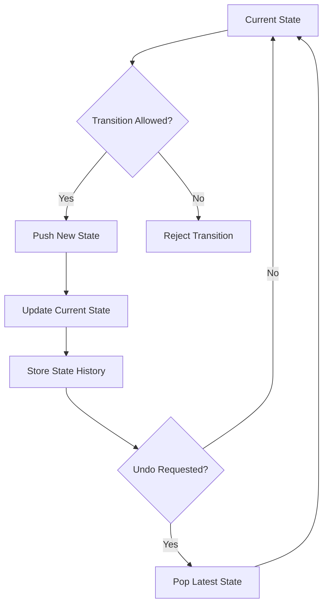

# 🧭 Constrained State Log (C-Log)

### Rule-Based State Transition System in C++

Constrained State Log (C-Log) is a C++ data-structure project that demonstrates how state transitions can be controlled using predefined rules while maintaining a reversible history of previous states.

The project combines a custom stack implementation with a rule map to allow only valid transitions between states.

---

## 🚀 Project Overview

The system stores the current state and its history using a linked stack.

Before a new state is added, the program checks whether the transition from the current state to the requested state is allowed.

If the transition is valid, the new state is pushed onto the stack.

If the transition is invalid, the operation is rejected.

The system also supports undo operations by removing the most recent state from the stack.

---

## 🧠 Core Concepts

This project demonstrates several important computer science concepts:

* Stack data structure
* Linked lists
* Dynamic memory allocation
* Rule-based state transitions
* Directed state relationships
* Maps and sets
* Object-oriented programming
* Constructors and destructors
* Pointers
* Undo operations
* State history tracking

---

## 🛠️ Technologies

`C++` · `STL` · `map` · `set` · `Pointers` · `Visual Studio`

---

## 🧱 Main Components

### `CLogNode`

Represents a single state in the stack.

Each node contains:

* The state name
* A pointer to the previous state node

---

### `RuleMap`

Stores the allowed transitions between states.

It uses:

```cpp
map<string, set<string>>
```

where:

* The key represents the current state
* The set contains all valid next states

Example:

```text
Erzurum → Erzurum Airport
Erzurum Airport → Check-in
Check-in → Security
Security → Gate
```

---

### `ConstrainedStateLog`

Controls the complete state-management process.

Its main responsibilities include:

* Adding a new state
* Validating transitions
* Removing the latest state
* Displaying state history
* Returning the current state
* Cleaning allocated memory

---

## ➕ Add a State

A new state is added using:

```cpp
Ekle("State Name");
```

Before the state is added, the system checks the transition rules.

If the transition exists in the rule map, the state is added to the stack.

Otherwise, an error message is displayed.

---

## ↩️ Undo a State

The latest state can be removed using:

```cpp
Sil();
```

This performs a stack `pop` operation and returns the system to the previous state.

---

## 📜 Display State History

The complete state history can be displayed using:

```cpp
Yazdir();
```

The program prints the states from the most recent state back to the initial state.

---

## 📍 Current State

The current state can be retrieved using:

```cpp
getCurrentState();
```

---

## ✈️ Example Scenario

The included example models a travel process beginning in Erzurum and moving through different travel states.

A valid sequence includes:

```text
Erzurum
↓
Erzurum Airport
↓
Check-in
↓
Security
↓
Gate
↓
Boarding
↓
Aden Airport
↓
Taiz
↓
Family
```

If the program attempts a transition that is not defined in the rule map, the transition is rejected.

---

## 🔄 Simplified Flow



---

## 🧹 Memory Management

The project uses dynamic memory allocation with:

```cpp
new
```

and releases memory using:

```cpp
delete
```

The destructor of `ConstrainedStateLog` ensures that all remaining nodes are deleted before the program exits.

---

## ▶️ Running the Project

The project was created using Visual Studio.

Open:

```text
denemk_proje.sln
```

in Visual Studio.

Then build and run the project.

Alternatively, the source file can be compiled directly with a compatible C++ compiler.

Example:

```bash
g++ denemk_proje.cpp -o constrained-state-log
```

Then run:

```bash
./constrained-state-log
```

On Windows:

```text
constrained-state-log.exe
```

---

## 📌 Project Purpose

The project was created to practice and demonstrate:

* Data structures
* State validation
* Stack operations
* Pointer-based linked structures
* C++ Standard Library containers
* Object-oriented programming
* Dynamic memory management

---

## 📄 License

No open-source license has been added yet.

Until a license is selected, all rights remain with the repository owner.
